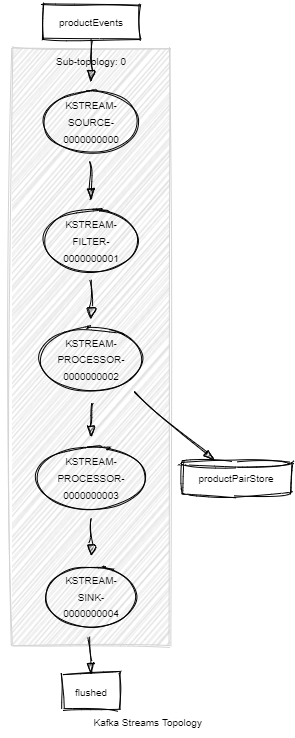

# catalog-synchronizer
this spring-boot 3 software reads a TSV format google product list file (default from resource directory /input, configurable with `path.input`), validates it and merge it in a sqlite database (`dbfilenamewithpath`). it uses apache kafka to handle the readed data. at the end it generates an XUni-type report (`path.output`) about how many record was readed and how long does it take. This report s easy to integrate in a CI Tool (e.g. Jenkins) because it there is an error, the job can be easily switched to "unsuccessfull". More details about the readed data and what exacly was done in the database, is stored in the kafka. every run has an unique requestid. Default the kafka-stream flushed 1000 records (`flushSize`) and Spring-JPA handles 100 entities (`hibernate.jdbc.batch_size`). Before every run, this software makes a backup about the sqlite database.

# How to run this Software
Start your own Kafka-Server (on localhost:9092) or go to the kafka folder and start a Kafka in docker with make start-kafka

Than run `mvn spring-boot:run -Dspring-boot.run.arguments="file1.txt"` where file1.txt is under resource directory /input when not configured otherwise (`path.input`).

Example output report file: [doc/report-72b8bde0-342b-4511-bf52-a565d9841b23.xml](doc/report-72b8bde0-342b-4511-bf52-a565d9841b23.xml)


# Configuration properties
application.properties

```
spring.kafka.bootstrap-servers=localhost:9092
topic.name.readedFromDb=readedFromDb
topic.name.validProduct=validProduct
topic.name.invalidProduct=invalidProduct
topic.name.flushed=flushed
topic.name.product=productEvents
topic.name.dbevent=dbEvents
topic.name.runs=runs

flushSize=1000

store.name.productPair=productPairStore

path.input=/input
path.output=output
```

persistence.properties

```
url=jdbc:sqlite:${dbfilenamewithpath}?date_class=TEXT
dbfilenamewithpath=src/main/resources/products.db
spring.jpa.database-platform=org.hibernate.community.dialect.SQLiteDialect
hibernate.jdbc.batch_size=100
hibernate.jdbc.batch_versioned_data=true
```
# Kafka Topology


# Kafka Producers and Consumers
[doc/springwolf.yaml](doc/springwolf.yaml)



# Product DB Schema

